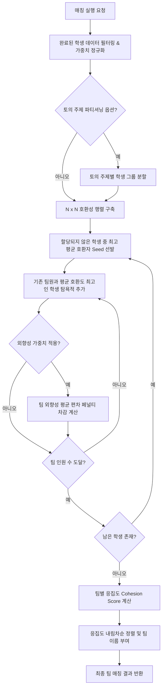

# Who-To V2 (팀 빌딩 & 세션 관리 플랫폼)

**Who-To V2**는 강의, 클래스 및 워크숍 환경에서 수강생(학생)들의 **역할 다양성(Role Diversity)**과 **관심사 유사도(Interest Similarity)**를 종합적으로 계산하여 최적의 팀을 자동으로 구성해 주는 팀 빌딩 웹 애플리케이션입니다.

---

## 1. 프로젝트 개요 (Overview)

Who-To V2는 강사가 세션을 만들고 학생들의 응답을 수집한 뒤, 설정한 알고리즘 가중치(역할, 관심사, 성향 등)에 따라 알고리즘 기반으로 최적화된 팀을 추천해 주는 서비스입니다.

### 주요 사용자 역할 (User Roles)
* **강사 (Instructor)**: 세션 생성, 팀 크기 및 항목별 가중치 설정, 참가자 현황 확인, 팀 빌딩 알고리즘 실행, 최종 결과 확인 및 이메일 전송
* **학생/참가자 (Student)**: 세션 코드를 통한 참가, 역할 태그 선택, 세부 관심사 선택, 영어 실력/성향/토의 주제 응답, 팀원 전달 메시지 입력

---

## 2. 기술 스택 (Tech Stack)

* **Frontend**: HTML5, Vanilla CSS3, JavaScript (ES6+ Native ES Modules)
  * 별도의 빌드 도구(Webpack, Vite 등)나 프레임워크(React, Vue 등) 없이 브라우저 네이티브 기술로 동작하여 경량화 및 빠른 로딩을 보장합니다.
* **Backend / Database**: Firebase Realtime Database
  * 세션 생성, 학생 응답 수집, 팀 매칭 결과 저장을 위한 실시간 데이터베이스 연동
* **Architecture**: Controller - Service - API 3계층 아키텍처 패턴

---

## 3. 디렉터리 구조 (Directory Structure)

```
who-to-v2/
├── index.html                      # 메인 SPA 싱글 페이지 HTML (뷰 스크린 포함)
├── class-session.html              # 수업 세션 페이지 HTML
├── style.css / class-session.css   # 애플리케이션 메인 스타일시트
├── app.js                          # 메인 진입점 및 이벤트 바인딩 초기화
├── firebase.json                   # Firebase 호스팅 및 데이터베이스 설정
├── database.rules.json             # Firebase Realtime Database 보안 규칙
├── PRD.md                          # 기능 제품 요구사항 정의서
├── DESIGN_V1.md                    # 디자인 및 렌더링 참고서
├── README.md                       # 프로젝트 종합 안내 문서 (본 문서)
├── src/                            # 모듈화 리팩토링 코드 (ES Modules)
│   ├── entry/
│   │   └── legacyBridge.js         # 글로벌 스코프(window.WHO2MEET) 호환성 브릿지
│   ├── features/                   # 도메인 기능별 모듈 계층
│   │   ├── create-session/         # 세션 생성 기능 (Controller, Service, Api)
│   │   ├── student-join/           # 학생 참가 기능 (Controller, Service, Api)
│   │   ├── profile/                # 프로필/태그 입력 기능
│   │   ├── instructor-dashboard/   # 강사 대시보드 및 세션 제어
│   │   ├── instructor-relogin/     # 강사 대시보드 재접속
│   │   ├── email-results/          # 팀 매칭 결과 이메일 발송
│   │   └── feedback/               # 피드백 제출
│   ├── services/
│   │   └── matching/               # 팀 빌딩 알고리즘 서비스
│   │       ├── matchingAlgorithm.js # 핵심 매칭 알고리즘 계산 모듈
│   │       └── runMatchingUseCase.js# 매칭 유즈케이스 모듈
│   ├── ui/                         # UI 컴포넌트 및 DOM 렌더러
│   └── data/                       # 데이터 헬퍼 및 세션 스토리지 관리
└── js/                             # 공통 유틸리티 및 렌더링 헬퍼
```

---

## 4. 리팩토링 이후 현재 코드 아키텍처 (Controller - Service - API)

기존 단일 스크립트 모놀리식 구조에서 코드의 읽기 쉬움과 확장성을 높이기 위해 **Controller - Service - API** 3계층 패턴으로 구조화되었습니다.

```
[User Action / UI Event]
        │
        ▼
┌─────────────────────────┐
│    Controller Layer     │  (DOM 이벤트 수집, 뷰 스크린 전환, UI 업데이트)
└───────────┬─────────────┘
            │
            ▼
┌─────────────────────────┐
│      Service Layer      │  (비즈니스 로직, 데이터 유효성 검증, 매칭 알고리즘)
└───────────┬─────────────┘
            │
            ▼
┌─────────────────────────┐
│        API Layer        │  (Firebase Realtime DB CRUD 및 데이터 비동기 입출력)
└─────────────────────────┘
```

* **Controller Layer (`src/features/*/*Controller.js`)**: 사용자 입력 수집, 버튼 클릭 이벤트 핸들링, `nav.showScreen()`을 이용한 뷰 전환 등 UI 제어 전반을 담당합니다.
* **Service Layer (`src/features/*/*Service.js`, `src/services/*`)**: 세션 데이터 검증, 태그 정제, 팀 매칭 알고리즘 실행 등 핵심 비즈니스 로직을 처리합니다.
* **API Layer (`src/features/*/*Api.js`)**: Firebase Realtime DB 경로에 접근하여 세션 및 학생 정보를 조회/저장하는 비동기 데이터 통신을 수행합니다.
* **Bridge Layer (`src/entry/legacyBridge.js`)**: 리팩토링된 모듈을 기존 글로벌 객체 `window.WHO2MEET` 하위에 바인딩하여, 기존 HTML 내 인라인 스크립트나 레거시 유틸리티와의 호환성을 완벽하게 유지합니다.

---

## 5. 주요 기능별 파일 매핑

| 기능 영역 (Feature Domain) | Controller | Service | API | 주요 역할 |
|---|---|---|---|---|
| **세션 생성 (Create Session)** | `createSessionController.js` | `createSessionService.js` | `createSessionApi.js` | 강사 세션 생성, 6자리 세션 코드 발급, 가중치 설정 |
| **학생 참가 (Student Join)** | `studentJoinController.js` | `studentJoinService.js` | `studentJoinApi.js` | 학생 이름/비밀번호 확인, 세션 참가 유효성 검사 |
| **프로필 입력 (Profile)** | `profileController.js` | `profileService.js` | `profileApi.js` | 역할(Role) 태그 및 세부 관심사(Interest) 태그 선택 |
| **강사 대시보드 (Instructor Dashboard)** | `instructorDashboardController.js` | `instructorDashboardService.js` | `instructorDashboardApi.js` | 세션 현황 실시간 감시, 매칭 실행, 팀 구성 확인 |
| **강사 재접속 (Instructor Relogin)** | `instructorReloginController.js` | `instructorReloginService.js` | `instructorReloginApi.js` | 세션 코드 및 강사 비밀번호 기반 대시보드 재접속 |
| **결과 이메일 전송 (Email Results)** | `emailController.js` | `emailService.js` | `emailApi.js` | 매칭된 팀 결과를 팀원 및 강사에게 이메일로 전송 |
| **피드백 수집 (Feedback)** | `feedbackController.js` | `feedbackService.js` | `feedbackApi.js` | 서비스 이용 피드백 수집 및 저장 |
| **팀 매칭 알고리즘 (Matching)** | `matchingController.js` (UI) | `matchingAlgorithm.js` | - | 팀 빌딩 핵심 알고리즘 및 응집도 점수 계산 |

---

## 6. 팀빌딩 알고리즘 상세 설명 (Team Building Algorithm)

팀 빌딩 알고리즘은 **`src/services/matching/matchingAlgorithm.js`** 파일에 구현되어 있으며, 수강생들의 다면적 데이터를 기반으로 탐욕적(Greedy) 팀 형성을 진행합니다.

### 6.1. 알고리즘 주요 파라미터 및 수식

알고리즘은 강사가 선택한 파라미터(`role`, `interest`, `extroversion`, `englishLevel`, `discussionQuestion`)와 각 파라미터의 설정 가중치를 기반으로 동작합니다.

#### 1) 가중치 정규화 (Weight Normalization)
선택된 모든 파라미터의 가중치 합을 구한 후 각 파라미터의 가중치를 0 ~ 1 사이로 정규화합니다.
$$\text{Weight}_{\text{param}} = \frac{W_{\text{param}}}{\sum_{\text{p} \in \text{Params}} W_{\text{p}}}$$

#### 2) 학생 쌍별 호환성 스코어 (Pairwise Score Formula)
두 학생 $A$와 $B$ 사이의 호환성 점수는 각 요인의 합으로 계산됩니다:

* **역할 다양성 (Role Diversity - Jaccard Distance)**: 서로 다른 역할 태그를 가질수록 높은 점수를 부여합니다.
  $$\text{Score}_{\text{role}} = W_{\text{role}} \times \left(1 - \frac{|\text{Role}_A \cap \text{Role}_B|}{|\text{Role}_A \cup \text{Role}_B|}\right)$$
* **관심사 유사도 (Interest Similarity - Jaccard Similarity)**: 동일한 세부 관심사를 공유할수록 높은 점수를 부여합니다.
  $$\text{Score}_{\text{interest}} = W_{\text{interest}} \times \left(\frac{|\text{Interest}_A \cap \text{Interest}_B|}{|\text{Interest}_A \cup \text{Interest}_B|}\right)$$
* **영어 실력 유사도 (English Level Similarity)**: 레벨 차이(1~5)가 적을수록 높게 계산합니다.
  $$\text{Score}_{\text{english}} = W_{\text{english}} \times \left(1 - \frac{|\text{Level}_A - \text{Level}_B|}{4}\right)$$
* **토의 주제 (Discussion Question)**: 동일한 토의 주제 선택 시 점수 부여 (또는 주제별 파티셔닝 매칭 수행).

#### 3) 호환성 행렬 (Compatibility Matrix)
모든 참가 학생 간의 쌍별 스코어를 계산하여 $N \times N$ 크기의 상호 호환성 행렬 $M[i][j]$를 구축합니다.

#### 4) 탐욕적 팀 구성 (Greedy Team Formation)
1. **Seed 선택**: 할당되지 않은 학생 중 전체 평균 호환 점수가 가장 높은 학생을 팀의 **Seed(기준점)**로 먼저 배치합니다.
2. **팀원 성장 (Grow Phase)**: 팀의 목표 인원 수(`teamSize`)에 도달할 때까지, 기존 팀원들과의 **평균 호환 점수를 가장 높여주는 학생**을 순차적으로 탐욕(Greedy) 추가합니다.
3. **외향성(Extroversion) 편차 보정**: 외향성 가중치가 포함된 경우, 팀의 외향성 평균이 전체 참가자 평균과 크게 벗어나지 않도록 페널티를 적용하여 팀원 간 성향 균형을 조율합니다.

#### 5) 팀 응집도 평가 (Team Cohesion Score)
구성된 팀 내의 모든 학생 쌍간의 평균 호환성 점수로 **팀 응집도(Cohesion Score)**를 산출하고, 응집도가 높은 순서대로 팀 이름(`Team A`, `Team B` ...)을 부여합니다.

### 6.2. 알고리즘 실행 흐름도 (Mermaid Visualizer)



---

## 7. 설치 및 실행 방법 (Getting Started)

Who-To V2는 별도의 빌드 및 번들링 과정이 필요 없는 Vanilla JavaScript 웹 프로젝트입니다.

### 1) 프로젝트 클론 및 폴더 이동
```bash
git clone <repository-url>
cd who-to-v2
```

### 2) 로컬 웹 서버 실행
ES Modules(`import / export`) 구문을 브라우저에서 올바르게 로드하기 위해 로컬 웹 서버 환경에서 실행해야 합니다.

* **VS Code 이용 시**: `Live Server` 확장을 설치한 뒤 `index.html`에서 마우스 우클릭 -> **Open with Live Server** 선택
* **Node.js `serve` 이용 시**:
  ```bash
  npx serve ./
  ```
  콘솔에 표시된 로컬 주소(예: `http://localhost:3000`)로 브라우저에 접속합니다.

### 3) Firebase 데이터베이스 설정 (선택 사항)
본 프로젝트는 기본적으로 Firebase Realtime Database와 연동되어 있습니다. 필요에 따라 자신의 Firebase 프로젝트로 교체하려면 `index.html` 내의 Firebase 설정 스크립트 및 `firebase.json`을 수정합니다.
